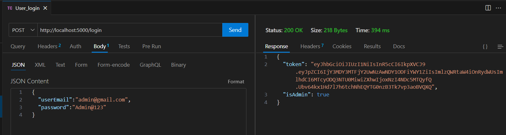

# GrowthX Backend Assignment

This repository contains the backend implementation for the GrowthX internship assignment. It is built using Node.js, Express, and MongoDB.

### Project Features
- **User Registration and Authentication**: Allows users to register with email,name and password, with secure password hashing and JWT-based authentication for access control.
- **Admin User Management**: Supports different roles (admin and regular users) to manage assignments effectively.
- **Assignment Upload and Management**: Users can upload assignments, with the system preventing duplicate submissions and allowing updates to existing assignments.
- **Admin Assignment Review**: Admins can view, accept, or reject assignments, ensuring a streamlined review process.
- **Email Validation**: Validates user emails during registration to ensure proper format.
- **Password Strength Validation**: Enforces strong password requirements to enhance security.
- **Secure Middleware**: Utilizes middleware to check authentication tokens and restrict access to sensitive routes.
- **Database Integration**: Utilizes MongoDB for data storage, managing users, assignments, and their statuses.
- **Real-time Feedback**: Provides immediate feedback on assignment uploads, including success messages and error responses.

## Table of Contents
- [Prerequisites](#prerequisites)
- [Installation](#installation)
- [Configuration](#configuration)
- [Running the Application](#running-the-application)
- [API Endpoints](#api-endpoints)


## Prerequisites

Before you begin, ensure you have met the following requirements:

- **Node.js**: Make sure you have Node.js installed. You can download it from [Node.js official website](https://nodejs.org/).
- **MongoDB**: You need to have MongoDB installed and running. Alternatively, you can use a cloud-based MongoDB service like MongoDB Atlas.
- **Git**: Ensure you have Git installed. You can download it from [Git official website](https://git-scm.com/).

## Installation

1. **Clone the repository**:
```
git clone https://github.com/lavakumar7619/GrowthX-Backend-Intern-Assignment.git
```

2. **Navigate to the project directory**:
```
cd GrowthX-Backend-Intern-Assignment
```
3. **Install dependencies**:
Use npm or yarn to install the required packages:
```
npm install 
```

## Configuration

1. **Create a `.env` file** in the root of the project to store your environment variables. You can use the `.env` file as a reference. Include the following variables:
```
PORT=5000
JWT_SECRET=your_jwt_secret
DB_URL=your_mongodb_uri
```
- **PORT**: Port number to run the application (default is 5000).
- **JWT_SECRET**: Secret key for signing JWT tokens.
- **DB_URL**: Connection string for your MongoDB database.

## Running the Application

To start the server, run the following command:
```
npm start
```

The server will start and listen on the port specified in the `.env` file (default is 5000). You should see a message indicating that the server is running.

### Example Output
```
Database connected,Server running on 5000
```

## API Endpoints

BaseURL= ```http://localhost:5000```

Here are the available API endpoints:

- **User Registration**
  - **POST** `/register`
  - Request Body: `{ "userEmail": "string", "userName": "string", "password": "string"}`
    - `{"isAdmin": true}` should be included for Admin Registration
    - Example
      User Register
    
    Input Validation
    
    Admin Register
    


- **User Login**
  - **POST** `/login`
  - Request Body: `{ "userEmail": "string", "password": "string" }`
  - Response :{"token":"string","isAdmin":boolean}
  - Example
    Admin/User Login
    

**Note** : Auth Bearer Token (from login response) Should be passed in header for below Endpoints


- **Get Admins List**
  - **GET** `/admins`
  - Example
    
    
- **Upload Assignment**
  - **POST** `/upload`
  - Request Body: `{ "task": "string", "admin": "string" }`
  - Example
 
     Admin not found for incorrect assignment from user
    
    
    Assignment uploaded successfully
    

    If same Assignment is uploaded then its updates
    

    
- **Get Assignments**
  - **GET** `/assignments`
  - Example
     List all assignmnets mapped for current admin in database
    
    

    Assignments after accept/reject status
    
    
- **Accept Assignment**
  - **POST** `/assignments/:id/accept`
  - Example Accept Assignment response
    
    
- **Reject Assignment**
  - **POST** `/assignments/:id/reject`
  - Example Reject Assignment response
 
    

  
### Authorization
- **JWT (JSON Web Tokens)** is used for user authentication and role-based access control, ensuring that only authorized users can access protected routes.

### Validation
- Input validation is performed within route handlers, ensuring that required fields are present and valid; consider using libraries for formal validation.


